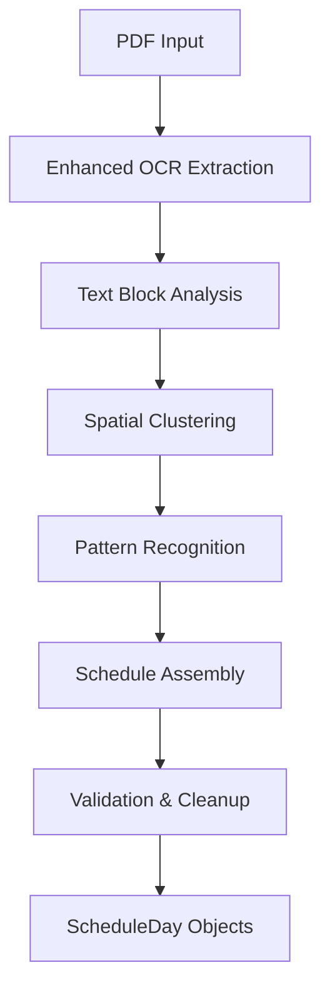

# Crew Schedule PDF Parsing Strategy

## Executive Summary

Based on OCR analysis, we'll implement a **hybrid parsing approach** that combines spatial analysis with pattern recognition to extract airline crew schedule data from PDFs like Orcun's and new_schedule.pdf.

## Core Architecture

### 1. Multi-Stage Parsing Pipeline



### 2. Data Models

```dart
// Enhanced text block with spatial information
class TextBlock {
  final String text;
  final Rect bounds;
  final double confidence;
  final int pageNumber;
}

// Parsed schedule event
class ScheduleEvent {
  final EventType type;
  final DateTime? time;
  final String? flightNumber;
  final String? origin;
  final String? destination;
  final String rawText;
}

enum EventType {
  flight,
  report,
  release,
  standby,
  reserve,
  off,
  hotel,
  transit,
  avac
}
```

## Parsing Strategies

### Strategy A: Enhanced Spatial Analysis

**When to use**: PDFs with clear table structure and good OCR quality

**Approach**:
1. Extract text blocks with coordinates from Google ML Kit
2. Use Y-coordinate clustering to identify rows (days)
3. Use X-coordinate clustering to identify columns (time slots)
4. Map grid positions to schedule events

**Implementation**:
```dart
class SpatialTableParser {
  List<TableRow> identifyRows(List<TextBlock> blocks) {
    // Group blocks by Y-coordinate ranges
    // Account for text height variations
  }
  
  List<ScheduleEvent> parseRow(TableRow row) {
    // Sort blocks by X-coordinate
    // Identify event sequences
  }
}
```

### Strategy B: Pattern-Based Sequential Parsing

**When to use**: PDFs with irregular layouts or poor spatial data

**Approach**:
1. Process OCR text sequentially
2. Identify day markers (dates, day names)
3. Group content between day markers
4. Parse aviation-specific patterns within each day

**Key Patterns**:
```dart
class AviationPatterns {
  static final dayNumber = RegExp(r'^\s*(\d{1,2})\s*$');
  static final timePattern = RegExp(r'\b(\d{2}):(\d{2})\b');
  static final flightPattern = RegExp(r'\b([A-Z]{2}\d+)\b');
  static final airportPattern = RegExp(r'\b([A-Z]{3})\b');
  static final dutyPattern = RegExp(r'\b(Report|Release|OFF|SB\d|RSV\d|AVAC)\b');
  static final connectionPattern = RegExp(r'~\s*(.+?)(?=\s|$)');
}
```

### Strategy C: Hybrid Approach (Primary)

**Combines both strategies with fallback logic**:

```dart
class HybridScheduleParser {
  Future<List<ScheduleDay>> parse(List<TextBlock> blocks) async {
    try {
      // Attempt spatial analysis first
      var result = await spatialParser.parse(blocks);
      if (result.confidence > 0.7) return result.schedule;
    } catch (e) {
      print('Spatial parsing failed: $e');
    }
    
    try {
      // Fallback to pattern-based parsing
      var text = blocks.map((b) => b.text).join('\n');
      return await patternParser.parse(text);
    } catch (e) {
      print('Pattern parsing failed: $e');
      return generateErrorSchedule(e);
    }
  }
}
```

## Aviation-Specific Logic

### Event Type Classification

```dart
class EventClassifier {
  static EventType classify(String text) {
    if (text.contains(RegExp(r'\b[A-Z]{2}\d+\b'))) return EventType.flight;
    if (text.contains('Report')) return EventType.report;
    if (text.contains('Release')) return EventType.release;
    if (text.contains('OFF')) return EventType.off;
    if (text.contains(RegExp(r'SB\d'))) return EventType.standby;
    if (text.contains(RegExp(r'RSV\d'))) return EventType.reserve;
    if (text.contains('Hotel')) return EventType.hotel;
    if (text.contains('AVAC')) return EventType.avac;
    if (text.contains('~')) return EventType.transit;
    return EventType.flight; // default
  }
}
```

### Flight Sequence Parsing

```dart
class FlightSequenceParser {
  List<ScheduleEvent> parseFlightSequence(String text) {
    // Example: "XQ590 AYT 06:37 ~ 11:06 LGW XQ591 LGW 12:35 ~ 16:55 AYT"
    var events = <ScheduleEvent>[];
    
    var segments = text.split('~');
    for (var segment in segments) {
      var flight = parseFlightSegment(segment.trim());
      if (flight != null) events.add(flight);
    }
    
    return events;
  }
}
```

### Time and Date Handling

```dart
class ScheduleTimeParser {
  DateTime? parseDateTime(String dateStr, String timeStr, {DateTime? baseDate}) {
    // Handle next-day indicators (+1)
    // Account for timezone considerations
    // Parse various time formats (24-hour)
  }
  
  Duration? parseDuration(String fromTime, String toTime) {
    // Calculate flight/duty durations
    // Handle overnight flights
  }
}
```

## Format-Specific Adaptations

### Orcun Schedule Format
- **Structure**: Calendar grid with daily events
- **Key Features**: Flight sequences, standby duties, OFF days
- **Parsing Focus**: Day-by-day event extraction
- **Special Handling**: Multi-segment flights with ~ connectors

### New Schedule Format  
- **Structure**: Extended AVAC periods with minimal flights
- **Key Features**: Long vacation blocks, international routes
- **Parsing Focus**: AVAC period detection, sparse event handling
- **Special Handling**: Mixed airline codes (XQ, DH, TK)

## Error Handling and Validation

### Multi-Level Validation

```dart
class ScheduleValidator {
  ValidationResult validate(List<ScheduleDay> schedule) {
    var issues = <ValidationIssue>[];
    
    // Date consistency checks
    issues.addAll(validateDateSequence(schedule));
    
    // Flight logic validation
    issues.addAll(validateFlightSequences(schedule));
    
    // Duty time validation
    issues.addAll(validateDutyTimes(schedule));
    
    return ValidationResult(schedule, issues);
  }
}
```

### Confidence Scoring

```dart
class ParsingConfidence {
  double calculateConfidence(List<ScheduleDay> schedule) {
    var score = 0.0;
    
    // Factor 1: OCR text quality
    score += ocrQualityScore * 0.3;
    
    // Factor 2: Pattern recognition success
    score += patternMatchScore * 0.3;
    
    // Factor 3: Data consistency
    score += validationScore * 0.4;
    
    return score.clamp(0.0, 1.0);
  }
}
```

## Implementation Phases

### Phase 1: Enhanced OCR Foundation
- [ ] Implement TextBlock extraction with coordinates
- [ ] Add spatial clustering algorithms
- [ ] Create basic pattern recognition

### Phase 2: Aviation Logic Layer
- [ ] Build event classifiers
- [ ] Implement flight sequence parsing
- [ ] Add time/date handling

### Phase 3: Format-Specific Parsers
- [ ] Orcun schedule parser
- [ ] New schedule parser
- [ ] Generic crew schedule parser

### Phase 4: Validation and Polish
- [ ] Comprehensive validation system
- [ ] Error recovery mechanisms
- [ ] Performance optimization

## Success Metrics

- **Accuracy**: >85% correct event extraction
- **Coverage**: >90% of schedule days parsed
- **Robustness**: Handles 3+ different schedule formats
- **Performance**: <5 seconds for typical PDF
- **Maintainability**: Clear separation of parsing strategies

## Risk Mitigation

1. **OCR Quality Issues**: Multiple preprocessing techniques, manual correction fallbacks
2. **Format Variations**: Pluggable parser architecture
3. **Performance**: Lazy loading, page-by-page processing
4. **Maintenance**: Comprehensive unit tests, pattern validation tools

This strategy provides a robust foundation for parsing various crew schedule formats while maintaining flexibility for future enhancements.